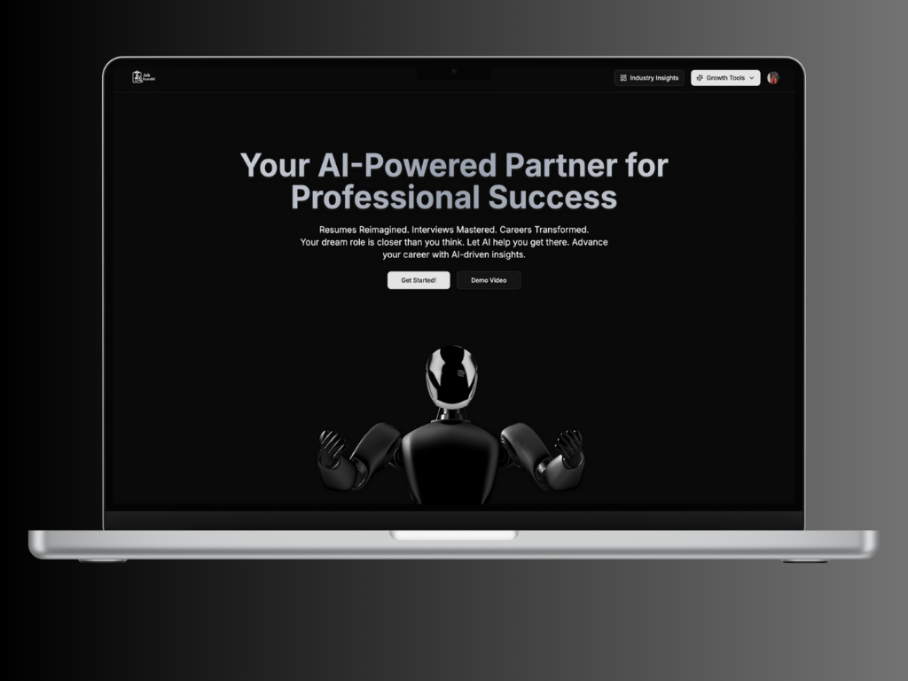

<h1 align="center"><strong>Job Board AI</strong>  
  
</h1>

  An AI-powered career development platform that helps job seekers create tailored cover letters, optimize resumes, prepare for interviews, and stay informed with industry insights all driven by the Gemini API.

<h2>Overview</h2>

  <strong>Job Board AI</strong> is a web-based job application and career enhancement platform that intelligently assists users across 15+ industries.
  By leveraging the Gemini API and modern cloud technologies, it automates time-consuming tasks like writing personalized cover letters,
  improving resumes, and preparing for interviews through AI-generated mock tests and improvement suggestions.

<h2>Key Features</h2>
<ul>
  <li><strong>AI-Generated Cover Letters</strong> – Automatically generates personalized cover letters based on your resume and job description using Gemini's advanced text generation.</li>
  <li><strong>Resume Analysis & AI Enhancements</strong> – Analyze your resume for clarity, keyword optimization, and structure. Enhance any section with the <em>"Improve with AI"</em> feature.</li>
  <li><strong>Mock Interview Tests</strong> – Simulate job-specific interviews with AI-generated questions and ideal response patterns.</li>
  <li><strong>Smart Career Reports</strong> – Get automated feedback and improvement suggestions based on performance and role requirements.</li>
  <li><strong>Weekly Industry Insights</strong> – Weekly job market data fetched via Inngest to keep users informed.</li>
  <li><strong>Multi-Industry Support</strong> – Supports 15+ industries including Tech, Finance, Healthcare, Marketing, and more.</li>
  <li><strong>Secure Authentication</strong> – Managed through Clerk for secure login and personalized user sessions.</li>
</ul>

<h2>Tech Stack</h2>
<ul>
  <li><strong>Frontend:</strong> Next.js</li>
  <li><strong>Backend:</strong> Serverless API routes (Next.js)</li>
  <li><strong>Database:</strong> NeonDB + Prisma</li>
  <li><strong>Authentication:</strong> Clerk</li>
  <li><strong>Background Jobs:</strong> Inngest</li>
  <li><strong>AI:</strong> Gemini API</li>
</ul>

<h2>Installation</h2>
<pre>
git clone https://github.com/your-username/job-board-ai.git
cd job-board-ai

npm install

cp .env.example .env
Update .env with your API keys and credentials

npm run dev
</pre>

<h2>⚙️ Configuration</h2>

Environment variables required:

<ul>
  <li><code>NEXT_PUBLIC_CLERK_PUBLISHABLE_KEY</code></li>
  <li><code>CLERK_SECRET_KEY</code></li>
  <li><code>DATABASE_URL</code></li>
  <li><code>GEMINI_API_KEY</code></li>
  <li><code>INNGEST_EVENT_KEY</code></li>
</ul>

<h2>Usage</h2>
<ol>
  <li>Log in using Clerk authentication</li>
  <li>Upload or paste your resume</li>
  <li>Select a job or enter job description</li>
  <li>Generate cover letter with Gemini AI</li>
  <li>Take a role-specific mock interview</li>
  <li>Receive AI feedback and suggestions</li>
  <li>Use "Improve with AI" to polish your text inputs</li>
  <li>Browse weekly industry trends on dashboard</li>
</ol>

<h2>Supported Industries</h2>

<strong>Job Board AI currently supports professionals in 15+ industries, including:</strong>

<ul>
  <li>Technology</li>
  <li>Financial Services</li>
  <li>Healthcare & Life Sciences</li>
  <li>Manufacturing & Industrial</li>
  <li>Retail & E-commerce</li>
  <li>Media & Entertainment</li>
  <li>Education & Training</li>
  <li>Energy & Utilities</li>
  <li>Professional Services</li>
  <li>Telecommunications</li>
  <li>Transportation & Logistics</li>
  <li>Agriculture & Food</li>
  <li>Construction & Real Estate</li>
  <li>Hospitality & Tourism</li>
  <li>Non-Profit & Social Services</li>
</ul>

